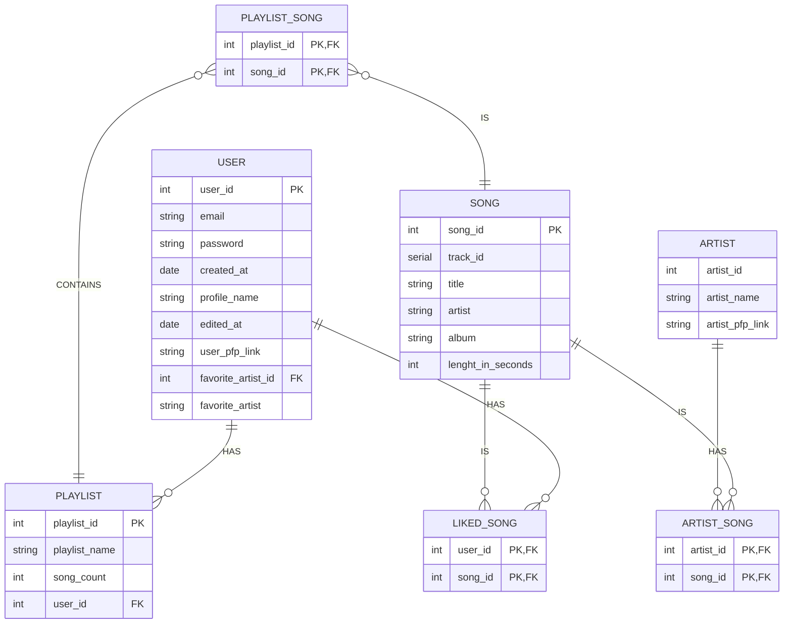

# Project Proposal

Introducing "Real Music" 🗣️🔥 - a web-based platform to search for and listen to music. This app is for:
- Music enjoyers who like to have on-the-go access to music from anywhere.

- People with OCD who want to store their favourite music in playlists under certain genres/artists.

## 🧱 Core Functionality

- **Playlist Creation:** Users can store their music in playlists.

- **Music Search:** Users are able to search for songs/artists.
  
- **Music Listening:** Users are able to play and listen to music.
  
- **Profile Creation:** Users are able to create/login to profiles to keep their playlists.
  
- **Liked Songs:** Users are able to like specific songs, which will appear in a pre-made playlist titled "Liked Songs".

- **Light Mode/Dark Mode:** Users are able to easily switch between a light mode display and a dark mode display.

- **Artist Information:** Users are able to search for artists and get info on that specific artist.

## 📋 Requirements

### Playlist Stories
- As a user, I want to create a playlist so that I can sort my music however I want.
- As a user, I want to be able to set the name of my playlist so I know which playlist is which.
- As a user, I want to be able to change the picture of the playlist so that I can make it look nice :)
  
### Song Stories
- As a user, I want to be able to search for a song by the title so that I can add it to a playlist or listen to it.
- As a user, I want to be able to search for an artist by name so that I can see all of their songs.

### Profile Stories
- As a user, I want to be able to register for a profile so that I can save my playlists.
- As a user, I want to be able to login to my profile so that I can retrieve all of my playlists.
- As a user, I want to be able to change my name in case I feel like having a different name.
- As a user, I want to be able to set a profile picture so that my profile can look nice :)

## ᛦ Entity Relationship

## 📍 API Routes

### Profile Management
| Request | Action | Response | Description |
| ----------- | ----------- | ----------- | ----------- |
| POST   /profile | ProfileController:createProfile | 201   /profile/:id | Creates a new profile. |
| PUT   /profile:id/name | ProfileController:editProfileName | 201   /profile/:id | Edits the name of a user's profile. |
| PUT   /profile:id/pfp | ProfileController:editProfilePfp | 201   /profile:id | Edits the picture of the user's profile. |
| DELETE   /profile/:id | ProfileController:deleteProfile | 201   / | Deletes a user's profile. |
| GET   /profile:id | ProfileController:getProfile | 200   ProfileView | Gets the profile of a specific user. |

### Playlist Management
| Request | Action | Response | Description |
| ----------- | ----------- | ----------- | ----------- |
| GET   /playlist:id | PlaylistController:getPlaylist | 200   PlaylistView | Gets a playlist. |
| POST   /playlist | PlaylistController:createPlaylist | 201   / | Creates a new playlist. |
| PUT   /playlist/:id/name | PlaylistController:editPlaylistName | 201   /playlist:id | Edits the name of the current playlist. |
| PUT   /playlist/:id/pfp | PlaylistController:editPlaylistPfp | 201   /playlist:id | Edits the profile picture of the current playlist. |
| DELETE   /playlist/:id | PlaylistController:deletePlaylist | 200   HomePageView | Deletes the current playlist. |

### Song Management
| Request | Action | Response | Description |
| ----------- | ----------- | ----------- | ----------- |
| PUT   /song/:id/liked | SongController:addLikedSong | 201   /search | Adds a song to liked songs playlist. |
| PUT   /song/:id/playlist | SongController:addSongToPlaylist | 201   /search | Adds a song to the current playlist. |

## Wireframes

### Home View

The homepage that every user sees the first time they load up the website. Non logged in users will not be able to click any of the buttons on the homepage until they are logged in (Exceptions: dark mode switch, profile icon).

### User Profile (Not logged in)

This is the view that non logged in users will see once they click the profile icon in the top right of the homepage. It has a register button at the bottom that allows users to register for an account.

### User Profile (Logged in)

This is the view that logged in users will see after registering for an account. It has an option to set/change both a profile picture and a username, it has a display of the user's favorite artist, and it has a logout button at the bottom.

### Library View

This view shows all the playlists that the user has created, alongside with the pre-made playlist titled "Liked Songs".

### Search View

This is the view that displays all the results for whatever the user has typed into the search bar. It will display mutiple results of songs/artists that match or are similar to the input from the user.

